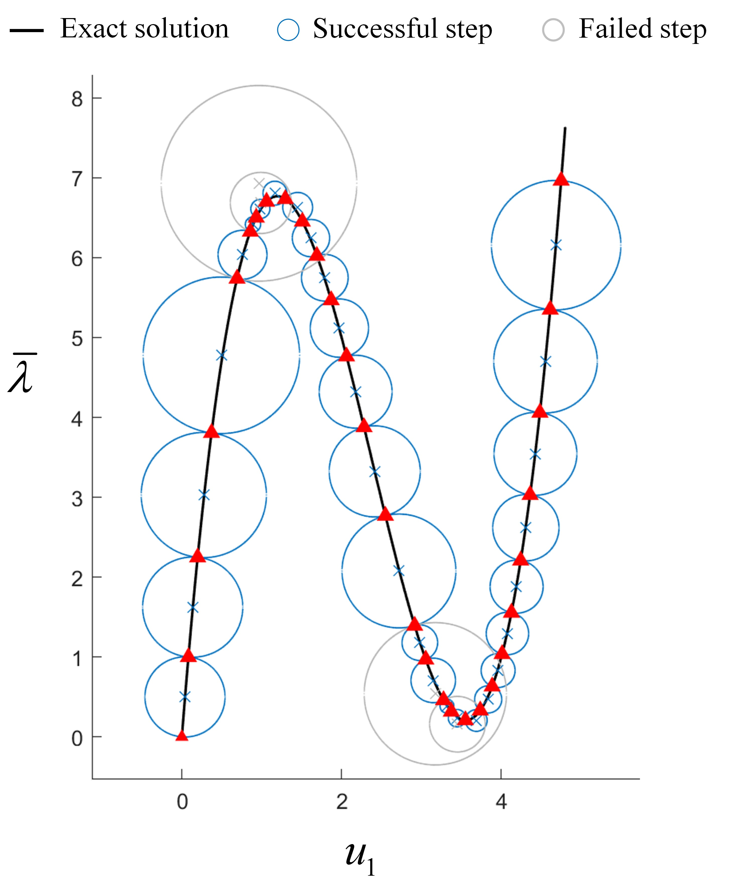
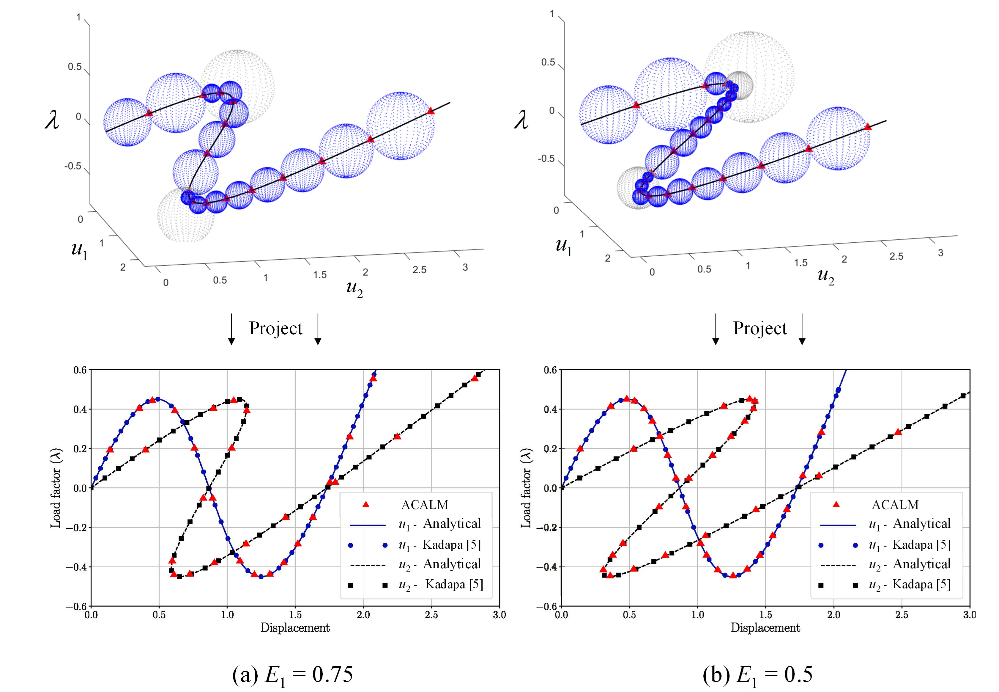
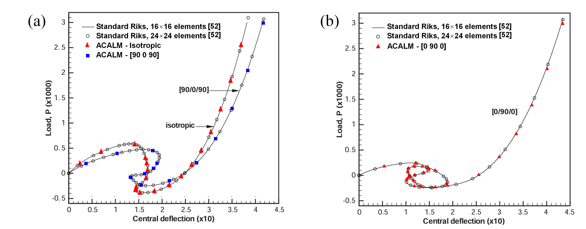

# Arc-Center Arc-Length Method (ACALM)

This repository provides the MATLAB/GNU Octave implementation of a novel
Arc-Center Arc-Length Method (ACALM) developed for tracing nonlinear
equilibrium paths with complex snap-through and snap-back behaviors. The method
is developed based on the mathematical proof that an individual equilibrium path
is generically non-self-intersecting in the augmented state space, as presented
in the associated manuscript. The source codes are provided to facilitate
reproducibility.

## Repository Structure

The repository contains the source codes for 2D/3D geometrical interpretations
and three benchmark examples:

- `Geometrical_interpretation_2D.m` and `Geometrical_interpretation_3D.m` are
  the main files for Section 2.4.1 of the manuscript.
- `Truss_planar_3_members.m` is the main file for Section 2.4.2 of the manuscript.
- `Truss_spatial_12_members.m` is the main file for Section 2.4.3 of the manuscript.
- `Hinged_cylindrical_roof.m` is the main file for Section 2.4.4 of the manuscript.
-  The `utils` folder contains geometrical input data and finite element implementations
  for computing the tangent stiffness matrix and global residual vector.

Some representative load-displacement equilibrium paths generated using the
provided codes are shown below.
- 2D geometrical interpretation

- 3-member planar truss

- Hinged cylindrical roof

## Third-Party Code

For consistency and comparability in the validation of the two truss benchmark examples,
parts of the finite element implementation are taken from the open-source codes developed 
by Chennakesava Kadapa and distributed under the MIT License. The relevant source files 
are identified individually in their headers.

See `THIRD_PARTY_NOTICES.md` for the original copyright and license information.
